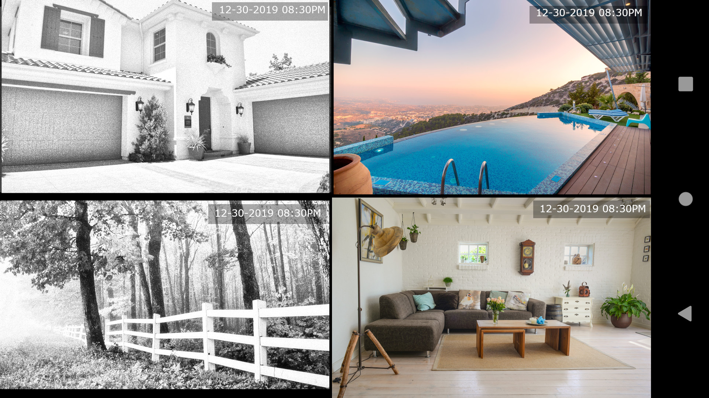

# ZMonitor

ZMonitor is an android app to view up to four live streams at once (useful for surveillance cameras)

## Installation
Compile and run yourself or 

## Screenshots

## Contributing
Pull requests are welcome. For major changes, please open an issue first to discuss what you would like to change.

## License
[GNU General Public License v2.0](https://choosealicense.com/licenses/gpl-2.0/)

Google Play and the Google Play logo are trademarks of Google LLC.
